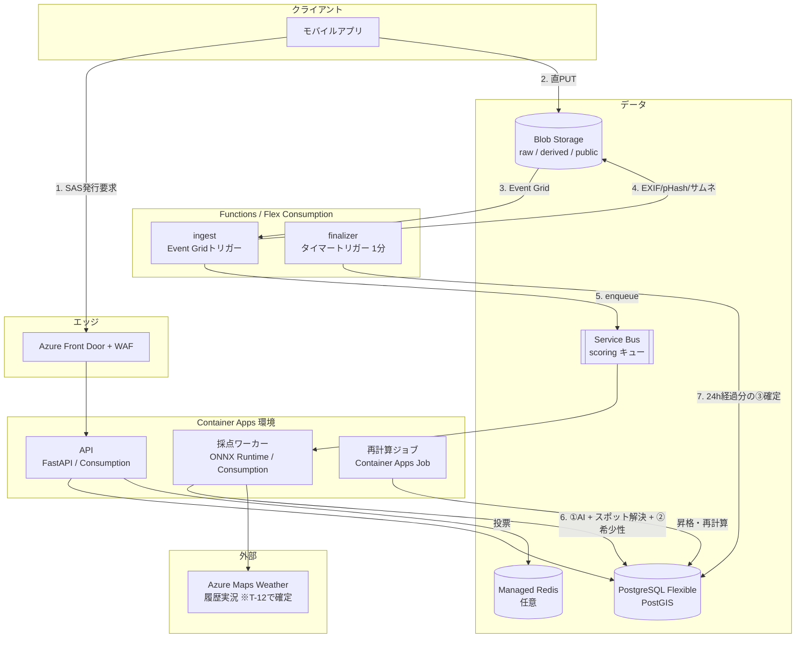

# Azureインフラ構成設計

> 引継ぎ書 §8「最優先タスク2」に対する設計。
> 対象範囲：投稿〜採点パイプライン、推論ホスティング、データストア選定、③の24時間遅延集計。
> 個人開発 / MVP を前提に、**アイドル時のコストをゼロに近づける**ことを最優先の制約として置いている。

---

## 0. 全体構成



**POI は外部サービスに出ない。** ADR-001（docs/06）で OpenStreetMap の抽出を
`poi_reference` として自前に取り込む方式に変えたため、スポット解決はすべて
PostgreSQL 内で完結する。外部に出るのは天候だけ（それも T-12 で確定）。

処理の要点は **「①は同期・②は同期・③だけ非同期」**。引継ぎ書§2の「確定タイミングをずらす」がそのままアーキテクチャの分割線になっている。

---

## 1. 画像アップロード 〜 採点パイプライン

### 1.1 アップロード：APIを経由させない

画像本体をAPIコンテナに通すと、コンテナのメモリと帯域が投稿数に比例して必要になる。**ユーザー委任SASを発行してクライアントからBlobへ直接PUTさせる**。

```
1. APP  → API : POST /uploads  （認証済み）
2. API        : posts に status='pending' で行を作成 → post_id
                Managed Identity で User Delegation SAS を発行
                （書き込みのみ / 15分 / パス固定 raw/{post_id}.jpg）
3. API  → APP : { post_id, upload_url }
4. APP  → BLOB: PUT upload_url  （画像本体）
5. APP  → API : POST /posts/{id}/commit  （座標・方位・撮影時刻などのメタ）
```

SASはアカウントキーではなく **User Delegation SAS**（Entra ID裏付け）を使う。アカウントキーはそもそも無効化しておく。

### 1.2 ingest（Azure Functions / Flex Consumption）

`raw` コンテナへの `BlobCreated` を **Event Grid ベースの Blob トリガー** で受ける。ポーリング方式（`LogsAndContainerScan`）ではなく `source = EventGrid` を明示すること。レイテンシが桁で違い、**Flex Consumption プランはそもそもイベントベースのトリガーしかサポートしない**。

ingest の責務（CPUのみ・数百ms）:

| # | 処理 | 出力先 |
|---|---|---|
| 1 | EXIF読み出し（GPS, `GPSImgDirection`, `DateTimeOriginal`, カメラ機種） | `posts` |
| 2 | **EXIF除去**した配信用画像を生成 | `public/{post_id}/full.webp` |
| 3 | サムネイル生成（256 / 1024） | `public/{post_id}/{size}.webp` |
| 4 | pHash / dHash 計算（転載検出用） | `posts.phash` |
| 5 | 技術品質の一次判定（ラプラシアン分散でブレ、輝度ヒストグラムで露出） | `posts.tech_quality` |
| 6 | 不正チェック（EXIF位置 vs 投稿位置、EXIF時刻 vs 投稿時刻、pHash重複） | `post_integrity_checks` |
| 7 | 採点キューへ enqueue | Service Bus |

**配信画像からのEXIF除去は必須**。原本の位置情報がそのまま公開されると、自宅から撮った1枚で住所が割れる。原本 `raw` コンテナは非公開のまま保持し、`public` だけを Front Door 経由で配信する。

### 1.3 採点ワーカー（Container Apps / Consumption）

Service Bus をKEDAスケーラで受けて起動。キューが空なら **0レプリカ**に落ちる。

```
1. ①AIベース点   : ONNX推論（§2）→ post_ai_scores                    ※未実装（T-14）
2. スポット解決   : docs/01 §1.2 のフロー → post_spot_assignment
                   （POIは自前の poi_reference を PostGIS で近傍検索。
                     外部APIは呼ばない → ADR-001 / docs/06）
                   実装: core/spots.py（worker/resolve.py が入口）
3. ②希少性ボーナス: 純SQL（db/migrations の calc_rarity_score）→ post_rarity_scores
4. ③の受付開始    : post_community_scores に finalize_at = now() + 24h で行を作成
5. posts.status = 'scored' → クライアントに①+②の暫定結果を返せる状態
```

**目標レイテンシ：投稿完了から①+②の確定まで3秒以内**。引継ぎ書§2「投稿した瞬間に点数が返る」が承認欲求設計の根幹なので、ここは他の何よりも優先してSLOを置く。3秒を超えるならAIモデルを軽くする側で調整する。

コールドスタートがこのSLOを壊すため、**採点ワーカーは `minReplicas = 1` を維持する**（アイドルコストが乗る唯一の場所）。投稿がほぼ発生しない深夜帯だけ0に落とすスケジュールスケーリングを入れてもよい。

---

## 2. 推論モデルのホスティング方針

### 2.1 比較

| 観点 | **Container Apps（推奨）** | Azure ML マネージドオンラインエンドポイント | Azure AI Vision |
|---|---|---|---|
| アイドルコスト | **0（スケール0対応）** | インスタンス常時課金（0にできない） | 従量のみ |
| 独自モデル | ○ 何でも載る | ○ 何でも載る | **× 不可** |
| Scenic-Or-Not転移学習の載せ替え | ○ イメージ再デプロイ | ◎ モデルレジストリ/セーフロールアウト | × |
| フラクタル次元の計算 | ○ 同一プロセスでOpenCV | ○ | × |
| GPU | 必要ならサーバーレスGPU（T4/A100、要クォータ申請） | ○ | N/A |
| MLOps（実験管理・A/Bルーティング） | 自前 | **◎** | — |
| 個人開発の運用負荷 | **低** | 中〜高 | 最低 |

### 2.2 判断

**Container Apps（Consumption）に ONNX Runtime を載せた自前コンテナ1本にする。** 理由:

1. **Azure AI Vision は要件を満たさない。** 引継ぎ書§6の中核であるフラクタル次元と Scenic-Or-Not 転移学習は既製APIでは出せない。空・雲の比率や要素検出（水域・山・建造物）だけなら AI Vision でも取れるが、そのために外部APIを1本増やすと、レイテンシとコストと障害点が増えるだけで、結局自前モデルは必要になる。
2. **Azure ML はアイドルコストが個人開発に対して重い。** マネージドオンラインエンドポイントは0インスタンスにできないため、投稿が1日10件でも常時課金になる。MLOps機能は魅力的だが、**モデル差し替えが月1回未満の段階では対価に見合わない**。
3. **CPUで足りる。** 想定モデルは EfficientNet-B0 / ResNet18 クラスの回帰ヘッド + 軽量セグメンテーション。384px入力なら ONNX Runtime + CPU 2vCPU で 150〜400ms。ここに OpenCV のフラクタル次元計算（数十ms、引継ぎ書§6の通り極めて安い）を足しても §1.3 の3秒SLOに十分収まる。**GPUは投稿レートが上がってから**（Container Apps のサーバーレスGPUに移すのはワークロードプロファイルの変更だけで済む）。

### 2.3 モデルバンドルのバージョニング

推論結果には必ず `model_bundle_version` を付けて `post_ai_scores` に保存する。粒度バージョン（docs/01 §4）と同じ思想で、**「どのモデルが出した点か」を後から特定できないと、日本向けファインチューニング（引継ぎ書§6の制約）を回したときに再計算の範囲が決められない**。

バンドルの中身:

```
model_bundle_v1/
  scenicness.onnx      # Places365バックボーン + Scenic-Or-Not転移学習
  segmentation.onnx    # 空・雲・水域のセグメンテーション
  weights.yaml         # 配点の重み（①50点の内訳）
  fractal.yaml         # D=1.4 を頂点とする山型関数のパラメータ
```

**`weights.yaml` をモデルと同じバンドルに入れるのが要点。** 引継ぎ書§8の未決定事項「配点の具体的な重み」は運用しながら必ず動かすことになるので、重みの変更もモデル差し替えと同じ手順（バージョンを切って再計算）に乗せる。

---

## 3. データストア選定

### 3.1 比較

| 要件 | PostgreSQL + PostGIS | Cosmos DB (NoSQL) | Azure AI Search |
|---|---|---|---|
| 半径検索 `ST_DWithin` | **◎ GiST索引** | △ 地理空間クエリは限定的 | ○ geo.distance |
| ファセット別ランキング（`RANK() OVER`） | **◎** | × アプリ側集計 | × |
| 「初」判定のアトミック性 | **◎ 一意制約 + upsert** | △ 楽観排他を自前実装 | × |
| 粒度バージョンの二重保持と一括再計算 | **◎ 単なる行** | △ RU消費が読めない | × |
| 個人開発のコスト予測性 | **◎ 固定SKU** | △ RU設計を誤ると跳ねる | 高い |
| スケール上限 | 縦（十分） | 横（不要） | — |

### 3.2 判断

**Azure Database for PostgreSQL フレキシブルサーバー（PostGIS）を単一のソース・オブ・トゥルースにする。**

このアプリのクエリは **地理空間検索よりも「ファセット内での相対順位」の比重が圧倒的に大きい**。引継ぎ書§3の表示ポリシー（「このスポット内で上位◯%」「朝焼け部門7位」）は、要するに全部ウィンドウ関数である。Cosmos DBを選ぶと、この中核機能を全部アプリ側のメモリ集計で書くことになる。地理空間要件は PostGIS で十二分に足りる。

確認済みの前提（[対応拡張機能一覧](https://learn.microsoft.com/azure/postgresql/extensions/concepts-extensions-by-engine)）:

| 拡張 | 可否 | 用途 |
|---|---|---|
| `postgis` 3.6.1 | **○** | 半径検索、重心計算 |
| `pg_cron` | **○** | 週次リセット、③のスイープの代替 |
| `pg_partman` | **○** | `votes` の月次パーティション |
| `h3` (h3-pg) | **×（非対応）** | → H3はアプリ層で計算し `bigint` 保存（docs/01 §5） |

SKU: MVPは **Burstable B2s + 32GB**。`votes` が膨らむのでストレージだけ先に伸ばす。バックアップは既定の7日で開始。

### 3.3 Redis の位置づけ

MVPでは **入れない**。必要になるのは以下が顕在化してからでよい。

- 投票ペアのサンプリング（同一ユーザーに同じペアを出さない）→ まずはPostgreSQLの `votes` にユニーク制約で足りる
- ランキング上位のキャッシュ → まずはマテリアライズドビューで足りる

---

## 4. ③コミュニティ加点の24時間遅延集計

引継ぎ書§2③「24時間かけて積み上がる」の実装。ここが設計判断の分かれ目になる。

### 4.1 選択肢

| 方式 | 仕組み | 評価 |
|---|---|---|
| **A. スイープ（採用）** | 1分間隔のタイマートリガーで `finalize_at <= now() AND finalized_at IS NULL` を拾って確定 | インフラは投稿数に依存せずO(1)。実装が単純 |
| B. Durable Functions | 投稿ごとにオーケストレーションを開始し、24時間の Durable Timer で待つ | **投稿1件ごとにインスタンスが1つ生きる。** 履歴テーブルへの書き込みが投稿数に比例。Python SDKのタイマー上限は6日（24hなら問題ないが、上限を意識する構造自体が負債） |
| C. Service Bus のスケジュール配信 | `ScheduledEnqueueTimeUtc` に24時間後を指定 | 実装は軽いが、確定処理をやり直したいときにキュー内メッセージの取り消し・再投入が要る |

**Aを採用する。** Bは「1件ずつ待つ」というモデルが直感的だが、承認欲求の設計上 **③の確定はバッチで一斉に走ってよい**（ユーザーは「翌日に結果が伸びている」ことだけを期待する）。1分粒度で十分であり、投稿数に比例して増える常駐インスタンスを抱える理由がない。

### 4.2 確定処理

```sql
-- finalizer（Functions タイマートリガー / 1分間隔）
WITH due AS (
    SELECT post_id FROM post_community_scores
    WHERE finalize_at <= now() AND finalized_at IS NULL
    ORDER BY finalize_at
    LIMIT 500
    FOR UPDATE SKIP LOCKED          -- 多重起動しても安全
)
UPDATE post_community_scores s
SET community_score = calc_community_score(s.elo_rating, s.vote_count),
    finalized_at    = now()
FROM due WHERE s.post_id = due.post_id;
```

`FOR UPDATE SKIP LOCKED` により、Functionsが複数インスタンスに膨らんでも二重確定しない。

### 4.3 Eloの更新は投票時にオンラインで

24時間待つのは**確定**だけで、Eloレーティング自体は投票が入るたびに即座に更新する。そうしないと、24時間後に数千票を一括処理する山ができる。

```
投票受信 → votes に INSERT
        → 両者の elo_rating を更新（K値は vote_count で逓減）
        → vote_count++
```

票数が少ない投稿は推定が不安定なので、確定時にベイズ縮約をかける（`calc_community_score` 内）。引継ぎ書§2③の「票数が少ない写真も適正な位置に収束する」は、Eloだけでなくこの縮約とセットで達成される。

### 4.4 週次リセット（引継ぎ書§8の未決定事項）

`pg_cron` で **毎週月曜 00:00 JST（= 日曜 15:00 UTC）** に `ranking_periods` の新しい行を作り、`ranking_entries` を再生成する。

```sql
SELECT cron.schedule('weekly-reset', '0 15 * * 0', $$ SELECT open_next_ranking_period() $$);
```

過去期間の `ranking_entries` は消さない。「先週◯◯部門1位」という称号（引継ぎ書§8）の原資になるため。

---

## 5. 不正対策の配置（引継ぎ書§5）

後付けが困難という指摘の通り、**ingest（§1.2）の中でパイプラインの一部として実行する**。判定結果は `post_integrity_checks` に残し、投稿は落とさず**フラグを立ててスコアだけ抑制する**（誤検知でユーザーを失うほうが損失が大きい）。

| チェック | 手段 | 検知時の扱い |
|---|---|---|
| 位置偽装 | EXIF `GPSLatitude/Longitude` と投稿位置の距離 > 500m | 「初」ボーナス無効、②を50%減 |
| 時刻偽装 | EXIF `DateTimeOriginal` と投稿時刻の乖離 > 7日 | 同上 |
| 転載 | pHash のハミング距離 <= 6 の既存投稿あり | **非公開化 + 手動レビューキュー** |
| EXIF欠落 | GPS/時刻がそもそも無い | 「初」ボーナス無効（②の基礎点は出す） |

pHashは64bitなので、`posts.phash bigint` に対して BK-tree を持たずとも、MVP規模では**直近90日分に対する総当たり `bit_count(phash # :target) <= 6`** で足りる（100万件でも数百ms）。ここが遅くなったら専用の索引構造を検討する。

---

## 6. セキュリティ

業務でAzure上のセキュリティ設計を担当している前提なので、逸脱しない範囲の既定値だけ挙げる。

- **すべてのサービス間認証を Managed Identity に統一。** ストレージアカウントキーとPostgreSQLのパスワード認証は無効化（Entra ID認証のみ）
- PostgreSQL は **プライベートエンドポイント**、パブリックアクセス無効
- Blob の `raw` / `derived` は非公開。`public` のみ Front Door 経由（ストレージへの直アクセスはFront Door のプライベートリンクで塞ぐ）
- Front Door に WAF（Bot Manager ルールセット）。投票APIは1ユーザーあたりのレート制限を必須にする —— **投票が票の暴力に晒されると引継ぎ書§2③の設計意図が崩れる**
- 座標は個人情報として扱う。**投稿位置の公開精度をユーザーが選べるようにする**（正確 / 500m丸め / 非公開）。丸めるのは表示用の値だけで、スコア計算には正確な値を使う

---

## 7. コスト設計

金額は変動するため [料金計算ツール](https://azure.microsoft.com/pricing/calculator/) で都度確認すること。ここでは **コストが乗る場所とその止め方** だけ確定させる。

| リソース | アイドル時 | 止め方 |
|---|---|---|
| PostgreSQL Flexible (B2s) | **常時課金（最大の固定費）** | 開発中は停止機能で夜間停止。本番は止められない |
| Container Apps API | 0にできる | `minReplicas=0`（初回アクセスが遅くなる） |
| Container Apps 採点ワーカー | **1レプリカ維持** | 3秒SLO（§1.3）とのトレードオフ。深夜のみ0 |
| Functions (Flex Consumption) | ほぼ0 | — |
| Blob Storage | 容量比例 | 90日経過した `raw` を Cool → Archive にライフサイクル移行 |
| Azure Maps（POI） | **ゼロ** | ADR-001 で不採用。OSM抽出を自前に取り込むので呼出そのものが無い |
| Azure Maps（Weather） | 呼出比例 | 派生値（`weather_kind`）だけを保存する。**生応答を溜めるテーブルは作らない**（規約。docs/06 §6）。採否は T-12 |
| Container Apps Job（昇格・再計算） | 0にできる | 実行時だけ課金。夜間バッチなので日次で数分 |
| Front Door | 下位SKUで固定費あり | MVPでは省略し、Blobの静的配信 + CDN無しで開始してもよい |

MVPの構成目標は **固定費をPostgreSQLと採点ワーカーの2つだけに集約する**こと。それ以外はすべて従量かゼロスケールに寄せる。

---

## 8. 未決定のまま残した点

| 論点 | 現状 | 判断に必要なもの |
|---|---|---|
| クライアント実装（ネイティブ / Flutter / React Native） | 未定 | EXIF `GPSImgDirection` の取得可否が端末依存なので、実機検証が先 |
| Front Door を初期から入れるか | **MVPでは省略** | 配信量が読めてから |
| 天候APIの選定 | Azure Maps Weather 想定 | 日本の粒度と課金。気象庁データとの比較。**キャッシュ条項の制約あり（docs/06 §6）** |
| ①の日本向けファインチューニングをいつ回すか | 投票データ1万件以降 | ③の投票が貯まる速度次第 |
| 収益モデル | 未着手 | 引継ぎ書§8のまま |

---

## 9. 実装との対応

構成図の各要素がどのコードに落ちているか。**未実装のものを「ある」ように書かない**ための表。

| 構成要素 | デプロイ単位 | 実装 | 状態 |
|---|---|---|---|
| API（SAS発行・投票） | `api/` | — | **未着手（T-19）**。認証 T-31 待ち |
| ingest（EXIF・pHash・サムネ） | `ingest/` | — | **未着手（T-13）** |
| 採点ワーカー ①AI | `worker/` | — | **未着手（T-14）**。特徴量検証 T-07 / T-08 待ち |
| 採点ワーカー スポット解決 | `worker/` | `core/spots.py` | ✅ 実装済み（T-15） |
| 採点ワーカー ②希少性 | `worker/` | `calc_rarity_score`（SQL） | 関数は実装済み。呼び出し側が未着手 |
| finalizer（③確定スイープ） | Functions or pg_cron | `calc_community_score`（SQL） | 関数は実装済み。スイープの起動は T-18 |
| DBSCAN昇格バッチ | `jobs/` | `core/clusters.py` | ✅ 実装済み（T-16） |
| 粒度再計算ジョブ | `jobs/` | — | **未着手（T-21）** |
| ランキング再生成 | pg_cron | `rebuild_ranking_entries`（SQL） | ✅ 実装済み |

### デプロイ単位の分け方

```
core/      デプロイ単位が共有するドメイン層（h3-py + psycopg）
scoring/   ファセット導出規則（標準ライブラリのみ）
worker/    採点ワーカー          Container Apps / Consumption
jobs/      バッチ                Container Apps Job
ingest/    取り込み              Functions / Flex Consumption   ※未着手
api/       API                   Container Apps                 ※未着手
```

`core/` と `scoring/` は**デプロイ単位ではない**。各イメージに同梱する共有ライブラリで、
それぞれのデプロイ単位が自分の `requirements.txt` を持つ。

`scoring/` の「標準ライブラリのみ」規約は `scoring/` にだけ掛かる。DBの再計算ジョブから
呼びやすくしておくための制約なので、`core/` 以降には適用しない。
